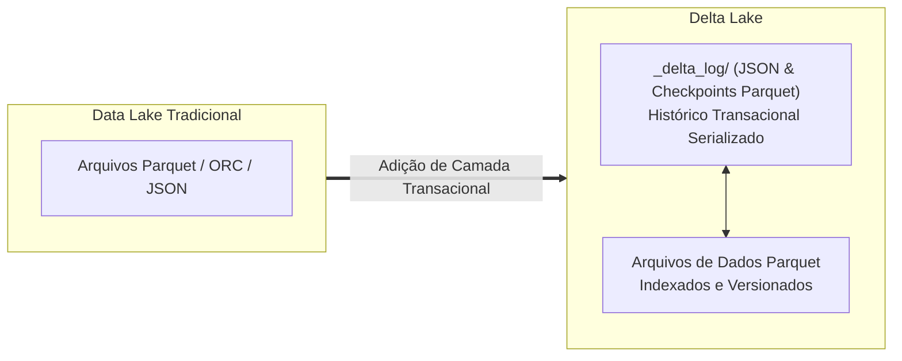

# Delta Lake: Formato Aberto Transacional para Lakehouse

---

> [!IMPORTANT]
> ### Área de Trabalho do Colega de Equipe
> Esta página é o espaço reservado e preparado para o colega de equipe responsável pelo módulo do **Delta Lake**.
> 
> A estrutura e os tópicos abaixo foram organizados como um guia de referência para manter o mesmo nível de profundidade e rigor técnico das páginas de [Apache Spark (PySpark)](spark.md) e [Apache Iceberg](iceberg.md).

---

## 1. O que é o Delta Lake?

*Seção destinada à introdução e história do Delta Lake:*
- Criado pela **Databricks** em 2019 e doado para a **Linux Foundation** como projeto de código aberto.
- Conceito de camada de armazenamento transacional sobre arquivos Parquet em Cloud Object Storage.
- Objetivo: Trazer confiabilidade, qualidade e desempenho ACID para Data Lakes existentes sem necessidade de migrar para bancos proprietários.



---

## 2. O Delta Log (`_delta_log/`): O Coração Transacional

*Explicar como o Delta Lake garante as propriedades ACID:*
- Registro de transações (*Transaction Log*): cada operação comita um arquivo JSON sequencial (`00000000000000000000.json`, `00000000000000000001.json`).
- Checkpoints periódicos em Parquet gerados a cada 10 commits para acelerar o estado da tabela.
- Controle de concorrência com **Serializabilidade Mútua** ou **Write-Serializable**.

---

## 3. Configuração do PySpark para Delta Lake

*Espaço para demonstrar como configurar a SparkSession com o runtime do Delta:*

```python
from pyspark.sql import SparkSession

# Exemplo de inicialização recomendada
spark = (
    SparkSession.builder
    .appName("DeltaLakeTest")
    .config("spark.jars.packages", "io.delta:delta-spark_2.12:3.2.0")
    .config("spark.sql.extensions", "io.delta.sql.DeltaSparkSessionExtension")
    .config("spark.sql.catalog.spark_catalog", "org.apache.spark.sql.delta.catalog.DeltaCatalog")
    .getOrCreate()
)
```

---

## 4. Evidências Práticas de CRUD no Delta Lake com PySpark

*Espaço para documentar as operações DDL e DML executadas no módulo prático do Delta Lake:*

### 4.1. CREATE & DDL
- Código de criação da tabela Delta e definição do esquema.

### 4.2. INSERT (Carga Inicial e Incremental)
- Ingestão do conjunto de dados e inserção em lote.

### 4.3. UPDATE (Atualizações Transacionais)
- Atualização via SQL (`UPDATE tabela SET ...`) ou via API do Delta Lake (`DeltaTable.forPath(...).update(...)`).

### 4.4. DELETE e MERGE INTO
- Exclusão direta (`DELETE FROM ...`) e operações de Upsert com `MERGE INTO`.

---

## 5. Recursos de Otimização e Manutenção

*Tópicos sugeridos para enriquecer a página:*
- **Compactação e OPTIMIZE**: Agrupamento de arquivos pequenos (*Small Files Problem*) em arquivos ideais de 1GB.
- **Z-Ordering (`OPTIMIZE ... ZORDER BY`)**: Técnica de ordenação multidimensional para acelerar filtros de alta cardinalidade.
- **Time Travel**: Consultas históricas por versão (`VERSION AS OF`) ou data (`TIMESTAMP AS OF`).
- **VACUUM**: Expurgar arquivos de dados antigos que já expiraram da janela de retenção.

---

## 6. Comparativo Síntese: Delta Lake vs. Apache Iceberg

| Critério | Apache Iceberg | Delta Lake |
| :--- | :--- | :--- |
| **Arquitetura de Metadados** | Árvore hierárquica (JSON + Avro) | Log de transações ordenado (JSON + Checkpoint Parquet) |
| **Governança e Origem** | Apache Software Foundation (Netflix) | Linux Foundation (Databricks) |
| **Independência de Engine** | Totalmente desacoplado (Spark, Trino, Flink, Dremio, ClickHouse) | Ampla adoção, máxima sinergia com o ecossistema Databricks/Spark |
| **Particionamento** | Particionamento Oculto (*Hidden Partitioning*) | Particionamento clássico baseado em colunas físicas |
| **Evolução de Partição** | Suporte nativo sem reescrever dados | Suporte em evolução |

---

> [!TIP]
> O código do notebook do Delta Lake pode ser adicionado em `src/spark_delta_lake/` seguindo o modelo adotado no módulo do [Apache Iceberg](iceberg.md).
