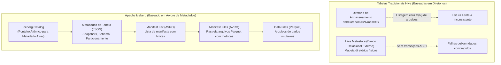
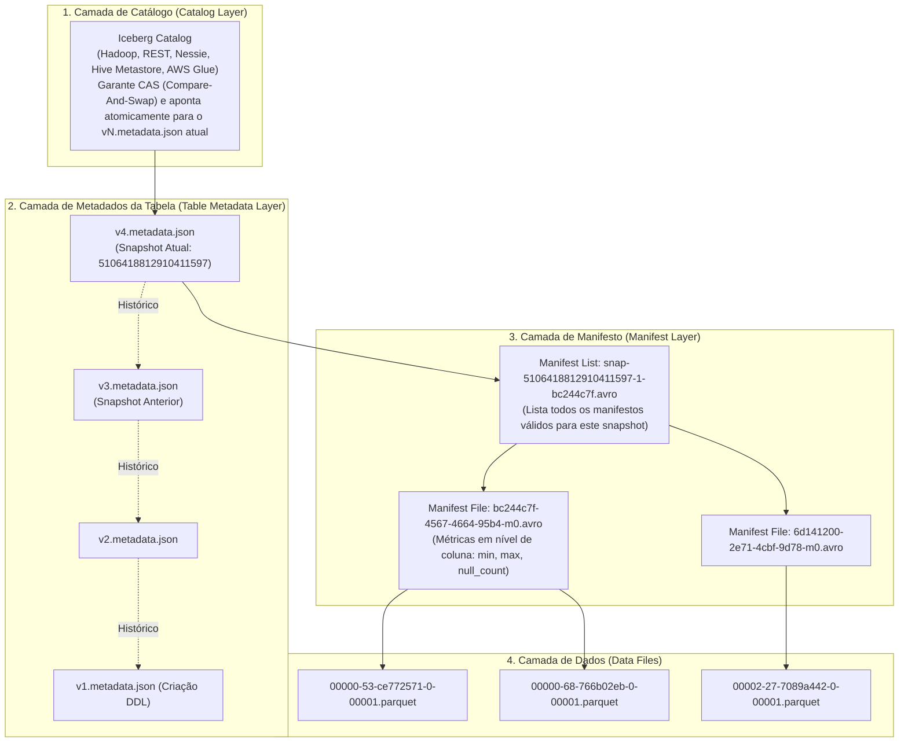
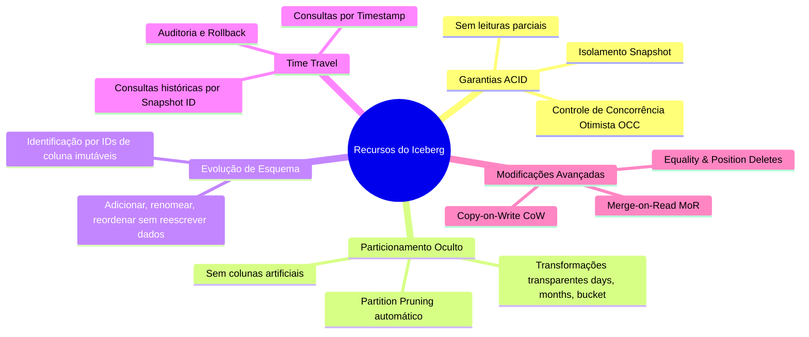
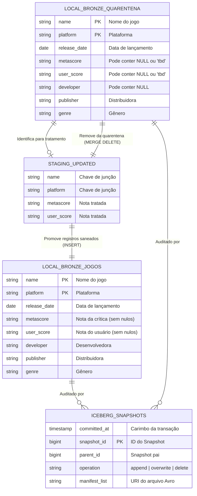

# Apache Iceberg: Formato Aberto de Tabelas para Lakehouse

---

## 1. Introdução e Contexto do Apache Iceberg

O **Apache Iceberg** é um formato aberto de tabela de alto desempenho (*Open Table Format*) projetado para gerenciar petabytes de dados em arquiteturas analíticas modernas. Criado originalmente na **Netflix** em 2018 por Ryan Blue e Dan Weeks e posteriormente aceito como projeto de nível superior (*Top-Level Project*) na Apache Software Foundation, o Iceberg foi concebido com uma missão clara: **eliminar os problemas crônicos das tabelas legadas do Apache Hive em ambientes de armazenamento em nuvem (S3, ADLS, GCS e HDFS)**.



### O Problema das Tabelas Hive em Nuvem
Durante anos, o padrão industrial para Data Lakes baseou-se na convenção do Apache Hive:
- **Tabela como um Diretório**: Uma tabela nada mais era do que um caminho no sistema de arquivos, e as partições eram subdiretórios hierárquicos (ex.: `/tabela/ano=2024/mes=10/arquivo.parquet`).
- **Listagem de Arquivos Lenta e Não Atômica**: Para consultar dados, o motor precisava executar operações `LIST` na API de armazenamento de objetos (como o S3). Em tabelas com milhões de arquivos, a simples listagem de diretórios podia levar dezenas de minutos antes de ler um único byte.
- **Ausência de Transações ACID**: Se um job falhava no meio da gravação, arquivos órfãos permaneciam no diretório, corrompendo consultas de outros usuários. Leitores concorrentes viam dados parciais em tempo real.
- **Dificuldade Extrema para Modificações (UPDATE e DELETE)**: Atualizar uma única linha exigia reescrever a partição inteira.

### A Solução do Apache Iceberg: Rastreamento em Nível de Arquivo
O Iceberg define que uma **tabela é um estado gerenciado por uma árvore de metadados imutáveis**, e não um diretório físico:
1. Ele rastreia cada arquivo de dados individualmente através de **arquivos de manifesto (Manifest Files)**.
2. Cada operação de escrita gera um **Snapshot** atômico e imutável.
3. Não há dependência de listagens de diretórios caras (`LIST` do S3). O motor analítico sabe exatamente quais arquivos ler consultando apenas os metadados.
4. Suporta transações **ACID completas**, **Time Travel**, **Evolução de Esquema sem dor** e **Particionamento Oculto**.

---

## 2. Arquitetura Interna do Apache Iceberg: As 3 Camadas de Metadados

A integridade e o alto desempenho do Apache Iceberg derivam de sua estrutura de metadados organizada em três camadas concêntricas:



### Detalhamento das Camadas

1. **Camada de Catálogo (Catalog Layer)**:
   - É a primeira porta de entrada. Armazena o ponteiro para o arquivo de metadado da versão atual da tabela.
   - Garante a atomicidade das transações utilizando operações atômicas como **Compare-And-Swap (CAS)** em catálogos como REST, Nessie ou DynamoDB, ou operações atômicas de renomeação em sistemas de arquivos (Hadoop Catalog).
   - Quando uma nova transação faz commit, o catálogo é atualizado atomicamente para apontar do arquivo `v3.metadata.json` para o novo `v4.metadata.json`.

2. **Camada de Metadados da Tabela (Table Metadata Layer)**:
   - Arquivos JSON nomeados sequencialmente (`v1.metadata.json`, `v2.metadata.json`, etc.).
   - Contêm o esquema da tabela atual e histórico de esquemas, a especificação de particionamento, as propriedades da tabela e a lista completa de todos os **snapshots** históricos.
   - Cada snapshot aponta para seu respectivo arquivo **Manifest List**.

3. **Camada de Lista de Manifestos (Manifest List)**:
   - Um arquivo binário no formato **Avro** (`snap-<snapshot-id>-<tentativa>-<uuid>.avro`).
   - Lista todos os arquivos de manifesto que compõem o estado daquele snapshot.
   - Inclui estatísticas das partições cobertas por cada manifesto, permitindo que motores como o Spark façam o **descarte antecipado de manifestos (Manifest Pruning)** sem precisar abrir todos os arquivos.

4. **Camada de Arquivos de Manifesto (Manifest Files)**:
   - Arquivos Avro (`<uuid>-m0.avro`) que mantêm o inventário individual de arquivos de dados Parquet.
   - Para cada arquivo de dados, o manifesto armazena o status do arquivo (adicionado, existente ou deletado) e **estatísticas colunares detalhadas**: valores mínimo e máximo de cada coluna, contagem de registros e contagem de valores nulos.
   - Graças a essas estatísticas, o Iceberg elimina arquivos inteiros na leitura (*Data Skipping / Predicate Pushdown*) antes mesmo de abrir os arquivos Parquet.

---

### Evidência Real: A Estrutura Física no Nosso Projeto

No laboratório prático implementado com PySpark, a tabela `local.bronze.jogos` gerou exatamente essa estrutura de arquivos no diretório `spark-warehouse/iceberg/bronze/jogos/`:

```
spark-warehouse/iceberg/bronze/jogos/
├── metadata/
│   ├── version-hint.text                           <- Indica a versão atual (4)
│   ├── v1.metadata.json                            <- Criação da tabela vazia
│   ├── v2.metadata.json                            <- Ingestão inicial dos 24.476 registros válidos
│   ├── v3.metadata.json                            <- Inserção de novos jogos (Jogos 2026)
│   ├── v4.metadata.json                            <- Inserção dos registros retificados da quarentena
│   ├── snap-6695676003824454030-1-fe5b10a4.avro   <- Manifest List do Snapshot 1
│   ├── snap-6225175166441985743-1-6d141200.avro   <- Manifest List do Snapshot 2
│   ├── snap-6461293759149600687-1-dcb782bb.avro   <- Manifest List do Snapshot 3
│   ├── snap-5106418812910411597-1-bc244c7f.avro   <- Manifest List do Snapshot 4
│   ├── 6d141200-2e71-4cbf-9d78-0feb475d9ad3-m0.avro
│   ├── dcb782bb-66b4-4d9f-bfb8-dcdfbe0b31cd-m0.avro
│   └── bc244c7f-4567-4664-95b4-f493b313a150-m0.avro
└── data/
    ├── 00000-68-766b02eb-3eaa-4ed9-85f6-d62a9c957d78-0-00001.parquet  <- Carga inicial
    ├── 00002-27-7089a442-d9cd-4e52-a120-acdbceb8d263-0-00001.parquet  <- Jogos 2026
    └── 00000-53-ce772571-852b-4f86-9bde-c0e63ce36dfe-0-00001.parquet  <- Registros retificados
```

---

## 3. Recursos Chave do Apache Iceberg



1. **Garantias ACID e Controle de Concorrência Otimista (OCC)**:
   - Leitores sempre leem um snapshot consistente e fixo da tabela. Enquanto um escritor escreve milhões de linhas, os analistas continuam consultando a versão anterior sem bloqueio (*lock-free reads*).
   - Quando dois escritores tentam salvar ao mesmo tempo, o Iceberg detecta se houve conflito de arquivos. Se os arquivos alterados forem disjuntos, ambos os commits são aceitos com sucesso.

2. **Particionamento Oculto (Hidden Partitioning)**:
   - No Hive, se você particionasse por data (`ano`, `mes`, `dia`), o usuário era obrigado a lembrar desses campos e escrever: `WHERE ano=2025 AND mes=9 AND dia=15`. Se ele escrevesse apenas `WHERE data = '2025-09-15'`, o Hive fazia um scan de toda a tabela!
   - No Iceberg, o particionamento é uma função da coluna de dados (ex.: `days(release_date)`). O usuário consulta naturalmente `WHERE release_date >= '2025-09-01'`, e o Iceberg traduz automaticamente o filtro para as partições corretas.

3. **Evolução de Esquema Segura (Full Schema Evolution)**:
   - Em tabelas comuns, se você renomear uma coluna ou reordenar colunas em um arquivo Parquet, os dados antigos que usam o nome original podem retornar nulos ou valores corrompidos.
   - O Iceberg atribui um **ID numérico inteiro único e imutável** a cada coluna. Renomear uma coluna simplesmente altera o mapeamento de metadados; os dados antigos continuam perfeitamente legíveis.

4. **Time Travel e Auditoria**:
   - Como os arquivos de versões antigas não são apagados imediatamente, qualquer usuário ou job pode consultar a tabela exatamente como ela existia em qualquer ponto do tempo passado, essencial para reprodutibilidade de modelos de IA e auditoria de faturamento.

---

## 4. Cenário Prático do Trabalho: O Conjunto de Dados Metacritic

### Descrição do Dataset
O cenário de negócio implementado baseia-se em um conjunto de dados analítico de avaliações de jogos do **Metacritic** (`metacritic_dataset_raw_sep_2025.csv`), compreendendo **36.831 registros brutos**.

O dataset espelha um desafio real de engenharia de dados: dados provenientes de fontes externas contêm imperfeições, como datas não preenchidas e jogos sem notas consolidadas de usuários ou da crítica especializada (`metascore` e `user_score` nulos ou com a marcação textual `'tbd'`).

### Dicionário de Dados

| Coluna | Tipo PySpark | Descrição | Registros Nulos no Raw |
| :--- | :--- | :--- | :--- |
| `name` | `StringType` | Nome comercial do jogo eletrônico | 0 |
| `platform` | `StringType` | Plataforma de lançamento (PC, PS4, Switch, etc.) | 0 |
| `release_date` | `DateType` | Data de lançamento oficial | 43 |
| `metascore` | `StringType` | Nota ponderada da crítica especializada (0 a 100) | 5.726 |
| `user_score` | `StringType` | Nota média do público (0.0 a 10.0 ou 'tbd') | 12.336 |
| `developer` | `StringType` | Empresa de desenvolvimento do jogo | 11 |
| `publisher` | `StringType` | Distribuidora comercial responsável | 0 |
| `genre` | `StringType` | Gênero do jogo (FPS, RPG, Action Adventure, etc.) | 0 |

---

### Modelo Lógico de Dados e Diagrama Entidade-Relacionamento (ER)

Para assegurar a qualidade dos dados na camada Bronze sem descartar informações que possam ser enriquecidas posteriormente, adotamos uma estratégia de segregação entre a tabela oficial de jogos e uma tabela de quarentena:



---

### Códigos DDL (Data Definition Language)

No Apache Iceberg com PySpark, a definição estrutural das tabelas pode ser expressa tanto através de SQL ANSI direto quanto de forma programática através da API de DataFrames.

=== "DDL em SQL ANSI (Iceberg)"

    ```sql
    -- Criação do namespace lógico (banco de dados)
    CREATE NAMESPACE IF NOT EXISTS local.bronze;

    -- Criação da tabela principal de Jogos com especificações de tipo
    CREATE TABLE IF NOT EXISTS local.bronze.jogos (
        name STRING NOT NULL,
        platform STRING NOT NULL,
        release_date DATE NOT NULL,
        metascore STRING NOT NULL,
        user_score STRING NOT NULL,
        developer STRING NOT NULL,
        publisher STRING NOT NULL,
        genre STRING NOT NULL
    ) USING iceberg
    PARTITIONED BY (genre);

    -- Criação da tabela de Quarentena para isolamento de dados nulos
    CREATE TABLE IF NOT EXISTS local.bronze.quarentena (
        name STRING,
        platform STRING,
        release_date DATE,
        metascore STRING,
        user_score STRING,
        developer STRING,
        publisher STRING,
        genre STRING
    ) USING iceberg;
    ```

=== "DDL Programático via PySpark (`StructType`)"

    ```python
    from pyspark.sql.types import StructType, StructField, StringType, DateType

    # Criação do Namespace
    spark.sql("CREATE NAMESPACE IF NOT EXISTS local.bronze")

    # Esquema formal da tabela principal
    schema_jogos = StructType([
        StructField("name", StringType(), False),
        StructField("platform", StringType(), False),
        StructField("release_date", DateType(), False),
        StructField("metascore", StringType(), False),
        StructField("user_score", StringType(), False),
        StructField("developer", StringType(), False),
        StructField("publisher", StringType(), False),
        StructField("genre", StringType(), False)
    ])

    # Criação da tabela vazia inicial no Catálogo Iceberg
    spark.createDataFrame([], schema_jogos) \
        .writeTo("local.bronze.jogos") \
        .createOrReplace()
    ```

---

## 5. Evidências Práticas de CRUD no Apache Iceberg com PySpark

Abaixo apresentamos a execução passo a passo realizada no notebook do projeto (`src/spark_iceberg/iceberg-pyspark.ipynb`), acompanhada do código fonte real e das saídas emitidas pelo Spark.

---

### Configuração Inicial da Sessão

```python
import os
from pathlib import Path
import jdk
from pyspark.sql import SparkSession

# Garante o OpenJDK 17 localmente
ROOT = Path.cwd().parent.parent
JDK_DIR = ROOT / ".jdk"
existentes = list(JDK_DIR.glob("jdk-17*")) if JDK_DIR.exists() else []
java_home = str(existentes[0]) if existentes else jdk.install("17", path=str(JDK_DIR))
os.environ["JAVA_HOME"] = java_home
os.environ["PATH"] = f"{java_home}/bin:" + os.environ["PATH"]

# Inicialização da SparkSession com Iceberg Runtime 1.6.1 e Hadoop Catalog
spark = SparkSession.builder \
    .appName("IcebergTest") \
    .config('spark.jars.packages', 'org.apache.iceberg:iceberg-spark-runtime-3.5_2.12:1.6.1') \
    .config("spark.sql.extensions", "org.apache.iceberg.spark.extensions.IcebergSparkSessionExtensions") \
    .config("spark.sql.catalog.local", "org.apache.iceberg.spark.SparkCatalog") \
    .config("spark.sql.catalog.local.type", "hadoop") \
    .config("spark.sql.catalog.local.warehouse", "spark-warehouse/iceberg") \
    .getOrCreate()
```

---

### 1. Ingestão e Carga Inicial (INSERT em Lote)

O pipeline lê o arquivo bruto do Metacritic, identifica as linhas que contêm valores nulos em qualquer coluna e as direciona para a tabela `quarentena`, enquanto as linhas válidas são inseridas na tabela oficial `jogos`:

```python
from functools import reduce
from pyspark.sql import functions as F

RAW_CSV = Path.cwd() / "data" / "metacritic_dataset_raw_sep_2025.csv"

df = spark.read \
    .option("header", True) \
    .option("inferSchema", True) \
    .csv(str(RAW_CSV))

# Cria condição booleana OR dinâmica para todas as colunas
null_condition = reduce(lambda x, y: x | y, [F.col(c).isNull() for c in df.columns])

# 1. Gravação dos dados inconsistentes na Quarentena
null_df = df.filter(null_condition).cache()
null_df.writeTo("local.bronze.quarentena").createOrReplace()

# 2. Inserção dos dados consistentes na tabela principal
valid_df = df.filter(~null_condition)
valid_df.writeTo("local.bronze.jogos").option("check-nullability", "false").append()
```

**Resultado da Carga Inicial:**
```
+---------+----------+-----------+
|namespace| tableName|isTemporary|
+---------+----------+-----------+
|   bronze|quarentena|      false|
|   bronze|     jogos|      false|
+---------+----------+-----------+

+--------------------+-----------------+------------+---------+----------+--------------+--------------------+-----------------+
|                name|         platform|release_date|metascore|user_score|     developer|           publisher|            genre|
+--------------------+-----------------+------------+---------+----------+--------------+--------------------+-----------------+
|The Legend of Zel...|      Nintendo 64|  1998-11-23|       99|       9.1|      Nintendo|['Nintendo', 'Gra...|Open-World Action|
|         SoulCalibur|        Dreamcast|  1999-09-08|       98|       7.6|         Namco|           ['Namco']|      3D Fighting|
|         SoulCalibur|iOS (iPhone/iPad)|  1999-09-08|       73|       7.8|         Namco|           ['Namco']|      3D Fighting|
|         SoulCalibur|         Xbox 360|  1999-09-08|       79|       7.3|         Namco|           ['Namco']|      3D Fighting|
| Grand Theft Auto IV|    PlayStation 3|  2008-04-29|       98|       8.0|Rockstar North|['Rockstar Games'...|Open-World Action|
+--------------------+-----------------+------------+---------+----------+--------------+--------------------+-----------------+
only showing top 5 rows
```

---

### 2. INSERT Incremental de Novos Dados

Demonstramos a inserção incremental simulando o cadastro de futuros lançamentos previstos para o ano de 2026:

```python
from datetime import date

new_games_df = spark.createDataFrame([
    ("Gears of War: E-Day", "Xbox Series X", date(2026, 10, 6), "87", "8.5", "The Coalition", "[Xbox Game Studio]", "Third Person Shooter"),
    ("Gears of War: E-Day", "PC", date(2026, 10, 6), "83", "tbd", "The Coalition", "[Xbox Game Studio]", "Third Person Shooter"),
    ("The Witcher 3: Wild Hunt - Remastered", "PC", date(2026, 9, 29), "93", "8.5", "CD Projekt Red Studio", "[CD Projekt, Red, Studio]", "Action RPG"),
    ("The Witcher 3: Wild Hunt - Remastered", "Nintendo Switch 2", date(2026, 9, 29), "95", "7.7", "CD Projekt Red Studio", "[CD Projekt, Red, Studio]", "Action RPG")
], ["name", "platform", "release_date", "metascore", "user_score", "developer", "publisher", "genre"])

# Operação INSERT atômica no Iceberg
new_games_df.writeTo("local.bronze.jogos").option("check-nullability", "false").append()
```

Essa operação gerou o snapshot `6461293759149600687`, adicionando 4 novos registros e gerando o novo arquivo de dados `00002-27-7089a442-*.parquet` sem afetar os dados existentes.

---

### 3. Operações de UPDATE

O Apache Iceberg viabiliza comandos `UPDATE` diretamente na linguagem SQL ou através de transformações controladas em DataFrames.

#### Método A: UPDATE via SQL ANSI Puro
Executamos uma atualização transacional pontual para preencher o `user_score` de *Super Mario Galaxy* na tabela de quarentena:

```sql
UPDATE local.bronze.quarentena 
SET user_score = 7.9 
WHERE name = 'Super Mario Galaxy' AND platform = 'Nintendo Switch';
```

#### Método B: UPDATE em Lote via DataFrame com `F.when()`
Para tratar múltiplos registros simultaneamente, lemos a tabela de quarentena, aplicamos as correções com lógica condicional e gravamos os registros corrigidos na tabela principal:

```python
pivot_df = spark.table("local.bronze.quarentena")

another_new_df = (
    pivot_df
    .withColumn("user_score", F.when((F.col("name") == "Super Mario Galaxy 2") & (F.col("platform") == "Nintendo Switch"), "8.4")
                               .otherwise(F.col("user_score")))
    .withColumn("metascore", F.when((F.col("name") == "Tony Hawk's Pro Skater 3") & (F.col("platform") == "Nintendo 64"), "tbd")
                             .otherwise(F.col("metascore")))
    .withColumn("user_score", F.when((F.col("name") == "Tony Hawk's Pro Skater 3") & (F.col("platform") == "Nintendo 64"), "tbd")
                               .otherwise(F.col("user_score")))
    .withColumn("user_score", F.when((F.col("name") == "Metroid Prime") & (F.col("platform") == "Wii"), "7.8")
                               .otherwise(F.col("user_score")))
    .withColumn("metascore", F.when((F.col("name") == "Metroid Prime") & (F.col("platform") == "Wii"), "tbd")
                             .otherwise(F.col("metascore")))
).filter(~null_condition)

# Inserção das linhas saneadas na tabela de jogos
another_new_df.writeTo("local.bronze.jogos").option("check-nullability", "false").append()
```

**Resultado da Tabela Atualizada:**
```
+--------------------+---------------+------------+---------+----------+--------------------+--------------------+-------------+
|                name|       platform|release_date|metascore|user_score|           developer|           publisher|        genre|
+--------------------+---------------+------------+---------+----------+--------------------+--------------------+-------------+
|  Super Mario Galaxy|Nintendo Switch|  2007-11-12|      tbd|       7.9|            Nintendo|        ['Nintendo']|3D Platformer|
|Super Mario Galaxy 2|Nintendo Switch|  2010-05-23|      tbd|       8.4|  Nintendo EAD Tokyo|['Nintendo', 'iQue']|3D Platformer|
|Tony Hawk's Pro S...|    Nintendo 64|  2001-10-30|      tbd|       tbd|Neversoft Enterta...|['Activision', 'S...|      Skating|
|       Metroid Prime|            Wii|  2002-11-17|      tbd|       7.8|       Retro Studios|        ['Nintendo']|          FPS|
+--------------------+---------------+------------+---------+----------+--------------------+--------------------+-------------+
```

---

### 4. Operações de DELETE com `MERGE INTO`

Após transferir os dados tratados para a tabela de jogos, é imperativo expurgar os registros corrigidos da tabela `quarentena`. No Apache Iceberg, isso pode ser executado atomicamente via instrução **`MERGE INTO`**:

```python
# Registra o DataFrame tratado como uma View Temporária do Spark
another_new_df.createOrReplaceTempView("updated")

# Executa a remoção atômica por correspondência de chaves
spark.sql("""
    MERGE INTO local.bronze.quarentena q 
    USING updated u 
    ON q.name = u.name AND q.platform = u.platform 
    WHEN MATCHED THEN DELETE
""")
```

#### Evidência Quantitativa no Snapshot do Iceberg

A integridade dessa exclusão é comprovada pela inspeção direta do snapshot `7664026871596913710` gerado na tabela `local.bronze.quarentena`:

| Propriedade do Metadado Iceberg | Valor Registrado | Significado Técnico |
| :--- | :--- | :--- |
| `operation` | `overwrite` | O Iceberg regravou os blocos afetados aplicando a exclusão atômica |
| `deleted-records` | **12.355** | Contagem de registros no arquivo antes da mutação |
| `added-records` | **12.351** | Contagem de registros no novo arquivo gerado |
| **Diferença Líquida** | **-4 registros** | **Exatamente os 4 registros modificados que foram excluídos com sucesso!** |

---

## 6. Time Travel e Inspeção de Metadados

Uma das maiores capacidades do Apache Iceberg é a introspecção das suas tabelas de sistema e a navegação temporal pelos snapshots.

### Consultando a Tabela de Snapshots

```python
spark.sql("SELECT committed_at, snapshot_id, parent_id, operation, summary FROM local.bronze.jogos.snapshots").show(truncate=False)
```

**Saída Emitida:**
```
+--------------------+-------------------+-------------------+---------+----------------------------------------------+
|committed_at        |snapshot_id        |parent_id          |operation|summary                                       |
+--------------------+-------------------+-------------------+---------+----------------------------------------------+
|2026-10-04 21:06:39 |6695676003824454030|NULL               |append   |{added-data-files -> 0, added-records -> 0}   |
|2026-10-04 21:06:40 |6225175166441985743|6695676003824454030|append   |{added-data-files -> 1, added-records -> 24476}|
|2026-10-04 22:35:00 |6461293759149600687|6225175166441985743|append   |{added-data-files -> 4, added-records -> 4}    |
|2026-10-04 23:35:55 |5106418812910411597|6461293759149600687|append   |{added-data-files -> 1, added-records -> 4}    |
+--------------------+-------------------+-------------------+---------+----------------------------------------------+
```

---

### Como Realizar Consultas com Time Travel

Se quisermos ler a tabela `jogos` exatamente no momento após a carga inicial (desconsiderando os novos lançamentos de 2026 e as retificações posteriores), basta informar o `snapshot-id`:

```python
# Consulta a versão exata do Snapshot 2 (Carga inicial)
df_historico = (
    spark.read
    .option("snapshot-id", 6225175166441985743)
    .table("local.bronze.jogos")
)

print(f"Total de registros na versão histórica: {df_historico.count()}")
# Retornará precisamente os 24.476 registros iniciais!
```

Ou ainda, navegar utilizando um carimbo de data/hora (*Timestamp*):

```python
df_por_tempo = (
    spark.read
    .option("as-of-timestamp", 1791158800000)
    .table("local.bronze.jogos")
)
```

---

## 7. Conclusão e Próximos Passos

O **Apache Iceberg** provou ser uma solução robusta e moderna para contornar todos os limites estruturais do Hive tradicional. Ele viabilizou:
- Transações ACID reais e seguras em ambiente de Lakehouse.
- Modificações pontuais e em lote com `UPDATE` e `MERGE INTO ... DELETE`.
- Rastreamento transparente de linhagem através de arquivos JSON/Avro imutáveis.
- Consultas reproduzíveis em qualquer ponto do tempo histórico.

> Para analisar a abordagem concorrente desenvolvida pela Databricks e pela Linux Foundation, acesse a página [Delta Lake](delta.md).
