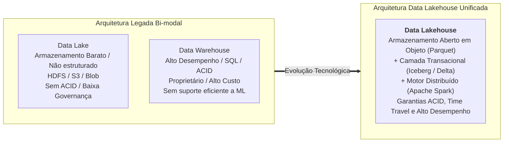
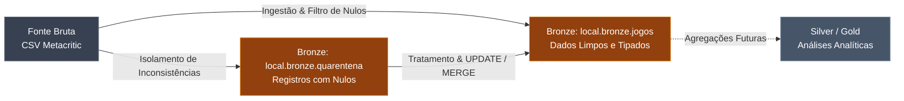

# Contextualização do Trabalho: Engenharia de Dados & Data Lakehouse

---

## 1. Visão Geral do Projeto

Este projeto tem como objetivo explorar, fundamentar e aplicar na prática os conceitos fundamentais da **Engenharia de Dados Moderna**, focando no ecossistema de processamento distribuído com **Apache Spark (PySpark)** e nos modernos **Formatos Abertos de Tabela (Open Table Formats)** para arquiteturas de **Data Lakehouse**: **Apache Iceberg** e **Delta Lake**.

Historicamente, os ambientes de dados eram divididos em dois silos distintos:

A arquitetura **Data Lakehouse** unifica o melhor dos dois mundos: a escalabilidade e o baixo custo de armazenamento de objetos (como S3, ADLS ou MinIO) com o rigor transacional, controle de concorrência e alto desempenho analítico dos Data Warehouses tradicionais.

---

## 2. Divisão de Escopo e Responsabilidades

Para garantir profundidade técnica e uma abordagem colaborativa, o trabalho foi dividido entre os membros da equipe da seguinte forma:

| Módulo / Página | Tecnologia / Foco | Responsável | Status |
| :--- | :--- | :--- | :--- |
| **Contextualização** | Fundamentação teórica, objetivos e cenário do trabalho | *Base estruturada* |
| **Apache Spark** | Arquitetura distribuída, PySpark, Catalyst, Tungsten, RDDs e DataFrames | **Concluído** |
| **Apache Iceberg** | Metadados em camadas, ACID, Cenário do Dataset, DDL, INSERT/UPDATE/DELETE | **Concluído** |
| **Delta Lake** | Delta Log, operações transacionais, comandos DML e otimizações | *Área de integração* |

---

## 3. Arquitetura em Medalhão Adotada

No pipeline prático desenvolvido no projeto, adotamos o padrão de arquitetura em **Medalhão** (Multi-hop Architecture), organizando os dados em camadas de qualidade progressiva:

1. **Camada Raw (Dados Brutos)**: Arquivos CSV originais obtidos do Metacritic (`metacritic_dataset_raw_sep_2025.csv`), contendo dados heterogêneos de notas e metadados de jogos.
2. **Camada Bronze (Ingestão & Quarentena)**: Tabelas gerenciadas nos formatos de tabela aberta contendo os dados brutos com schema explícito, com separação imediata de anomalias (dados nulos) em uma tabela de quarentena.
3. **Tratamento & Limpeza Transacional**: Aplicação de operações `UPDATE` e `MERGE INTO` para corrigir inconsistências e migrar os dados saneados para a tabela principal.

---

## 4. Navegação do Projeto

Explore as seções detalhadas através da barra de navegação superior ou pelos atalhos abaixo:

-   :material-lightning-bolt: **[Apache Spark (PySpark)](spark.md)**

    ---

    Compreenda a fundo o motor de processamento distribuído: arquitetura Driver/Executors, DAG, otimizadores Catalyst e Tungsten, transformações estreitas e largas e a ponte Py4J.

-   :material-snowflake: **[Apache Iceberg](iceberg.md)**

    ---

    Descubra o formato aberto de tabelas da Netflix: arquitetura de metadados em 3 camadas, particionamento oculto, Time Travel, e a execução prática de INSERT, UPDATE e DELETE com evidências reais.

-   :material-delta: **[Delta Lake](delta.md)**

    ---

    Seção dedicada à análise do formato transacional Delta Lake, seu log de transações baseado em JSON, conformidade ACID e recursos de compactação e vácuo.

---

> [!NOTE]
> **Espaço Reservado para o Colega de Equipe**:
> A contextualização detalhada do problema de negócio, os requisitos acadêmicos da disciplina e a bibliografia complementar serão enriquecidos pelo membro responsável por este módulo.
